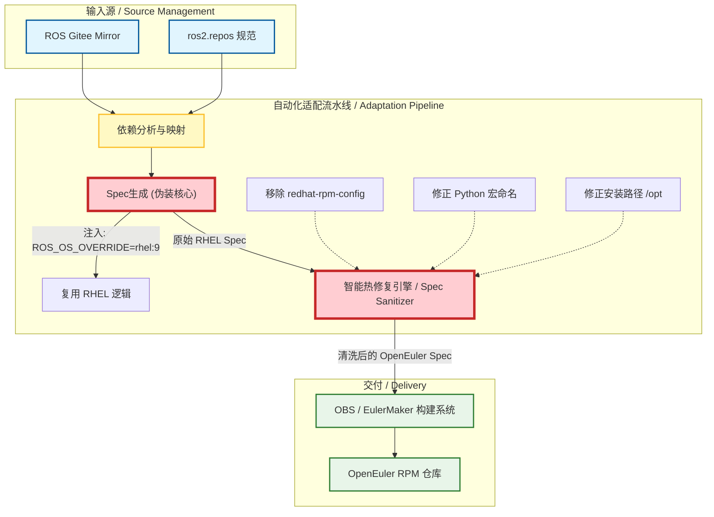

# EulerROS-Solution：openEuler 系统的 ROS 大规模适配与自动化构建方案

## 项目简介 (Executive Summary)

该方案是针对 openEuler（非 ROS 官方一级支持平台）的 **ROS 2 大规模自动化适配解决方案**。

面对 ROS Humble 即将停止维护与 OpenEuler 生态亟需跟进 ROS Jazzy 的双重挑战，我放弃了传统的“硬移植工具链”路线，转而实现基于 系统伪装 (OS Masquerading) 与 动态热修复 (Dynamic Hot-fixing) 的轻量化架构。

目前，该方案已成功在 OpenEuler 上实现了 500+ 个 ROS 软件包 的自动化构建与验证，在将维护成本降低 90% 的同时，确保了与上游生态的紧密同步。

## 架构演进与决策 (The Architecture Evolution)

该项目的核心价值在于如何使用更少的代码、更低的维护来实现过往的相同的目标（即构建出 ROS Desktop），所以我即将展示我是如何针对业务痛点所做出对应的的关键技术决策。

### 第一阶段：传统移植的困境 (The Legacy Approach)

在项目一开始，我的同事做过类似的事情并且给出了移植 ROS 官方工具链（Bloom, Rosdep 等）的方案，我尝试复现同事的经验，其实这是可行的。

我修改了 Bloom 源码以识别 OpenEuler 系统（详见 04_Legacy_Archives）。

但是这样会有新的问题就是在以前维护的那个 ROS 版本下是可用的，但是现在版本不同了，所以 rosdep 的 key 映射表需要人工持续更新维护，去更近 ROS 以及 openEuler 上游。这是一个蛮大的维护压力。

尤其是当这个项目变成只有我一个人在处理的时候，来维护这个映射表对于我而言效益过低，所以后续就不得不找一个更有效率的方法。

### 第二阶段：系统伪装与自动化修复 (The Current Solution)

后续，重新调研了 ROS 官方的文档，发现了官方其实已经给过了非 ROS 官方支持系统的建议。

其实逻辑就是将系统进行伪装，而与 openEuler 最相近的系统就是 rhel9，可以利用 ROS_OS_OVERRIDE=rhel:9 环境变量，将 OpenEuler 伪装成 RHEL 9，直接复用 ROS 官方成熟的构建逻辑。

但是这么做也有新的问题出现，也就是伪装会穿帮。

针对伪装后出现的“穿帮”问题（如 RHEL 特有的 redhat-rpm-config 缺失、Python 包命名宏差异、OpenCV 打包规范不一致等），开发了一套 Spec 清洗与热修复脚本。

最后实现了从源码拉取到 RPM 打包的全链路自动化。

### 决策收益

这么做的好处就是在于，我可以完全不碰 ROS 的官方工具链，这样就意味着不需要去跟进 ROS 官方庞大的维护压力。

同时，无论是随着 ROS 官方的版本更新还是 openEuler 社区的版本更新，该思路都是可以直接复用的。

简单而言就是，该逻辑对于代码零侵入性，可复用性超高。

## 系统架构图 (System Architecture)

## 项目导航 (Navigation)

01. 战略与方法论 (Strategy & Methodology)

> 我是如何做决策的

- 详细阐述为什么我们要放弃移植工具链。

- 深入解析自研的“系统级依赖验证方案”。

- 包含 Verification_Scheme.md 等核心设计文档。

02. 自动化流水线 (The Automated Pipeline)

如何从 0 到构建

- Core Scripts: 包含系统伪装配置、Spec 自动清洗脚本、Skip-keys 黑名单逻辑。

- Tools Manual: OBS 与 EulerMaker 的操作与配置指南。

- Gap Analysis: 详细记录了伪装策略下的四类典型报错及其修复逻辑。

03. 成果展示 (Evidence of Success)
   
- 500+ 软件包构建状态清单 (Verified List)

- 构建成功截图与 Demo 演示

04. 历史归档 (Legacy Archives)
   
- 这里保留了早期尝试“硬移植” Bloom 和 Rosdep 的代码与记录。

- 虽然这套方案已被废弃，但它证明了我们在底层工具链原理上的深入探索。

本项目旨在为 ROS 在 OpenEuler 上甚至是非 ROS 官方支持的系统的生态建设提供参考范式。 如有任何技术交流需求，欢迎提出 Issue 或联系作者。